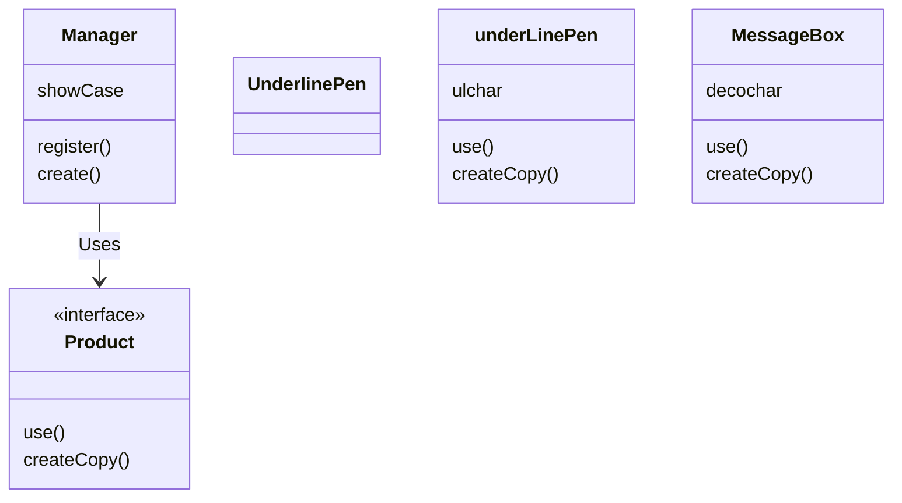

# © Prototype 패턴

- new를 사용해 인스턴스를 만들 때에는 클래스 이름을 반드시 지정해야만 함.
    
    ```java
    new Something()
    ```
    
- 클래스 이름을 지정하지 않고 인스턴스를 생성하고 싶을 때
    - 클래스로부터 인스턴스를 만드는대신, **인스턴스를 복사해서 새 인스턴스** 만들기.

## 언제 쓰이죠? 🤔

### 1. 종류가 너무 많아 클래스로 정리할 수 없는 경우

- 취급할 오브젝트 종류가 너무 많아서, 하나하나 다른 클래스로 만들면 소스 파일을 많이 작성해야하는 경우

### 2. 클래스로부터 인스턴스 생성이 어려운 경우

- 생성하고 싶은 인스턴스가 복잡한 과정을 거쳐 만들어지는 것으로, 클래스로부터 만들기가 매우 어려운 경우
    - `ex` : 그래픽 에디터로부터 사용자가 마우스로 그린 도형을 나타내는 인스턴스가 있을 경우.
    - 사용자 조작으로 만들어진 인스턴스와 같은 것을 다시 만들고 싶은 경우에는 지금 만든 인터페이스를 일단 저장 해 두고 만들고 싶을 때 그것을 복사

### 3. 프레임워크와 생성하는 인스턴스를 분리하고 싶은 경우

- 인스턴스를 생성하는 프레임워크를 특정 클래스에 의존하지 않게 하고 싶은 경우
- 클래스 이름을 지정해서 인스턴스를 만드는 것이 아닌. 미리 원형이 될 인스턴스를 등록한 후 등록된 인스턴스를 복사해서 인스턴스 생성

> 인스턴스로부터 다른 인스턴스를 생성하는 것은 복사기로 문서를 복사하는 것과 비슷하다 🖨

원본 서류를 어떻게 만들었는지 모르더라도 복사기에 넣으면 같은 서류를 몇 장이든 만들 수 있음.
> 

> **Prototype은 ‘원형’ ‘모범’이라는 뜻으로 원형이 되는 인스턴스, 모법이 되는 인스턴스를 바탕으로 새로운 인스턴스를 만듦**
> 

# 예제프로그램

- 문자열을 테두리로 감싸서 표시하거나, 밑줄을 그어 표시하는 프로그램
    
    
    | 패키지 | 이름 | 설명 |
    | --- | --- | --- |
    | framework | Product | 추상 메소드 use와 createCopy가 선언되어 있는 인터페이스 |
    | framework | Manager | createCopy를 사용하여 인스턴스를 복제하는 클래스 |
    | - | MessageBox | 문자열을 테두리로 감싸서 표시하는 클래스로 use와 createCopy를 구현 |
    | - | underlinePen | 문자열에 밑줄을 그어 표시하는 클래스로 use와 createCopy를 구현 |
    | - | Main | 동작 테스트용 클래스 |
    - Manager 클래스는 createCopy를 호출하지만 구체적으로는 어느 클래스의 인스턴스를 복제할지 관여하지 않음
        - Product를 구현한 클래스이기만 하면 해당 인스턴스를 복제할 수 있음
    - MessageBox 클래스와 Underline 클래스는 모두 Product 인터페이스를 구현한 클래스
        - 이 인스턴스를 만들어서 Manager 클래스에 등록해 두면 원하는 대로 복제할 수 있음



# ProtoType의 등장인물👯‍♀️

## Prototype (원형)

- 인스턴스를 복사하여 새로운 인스턴스를 만들기 위한 메소드 결정
- `ex` Product 인터페이스

## ConcretePrototype(구체적인 원형)

- 인스턴스를 복사하여 새로운 인스턴스를 만드는 메소드 구현
- `ex` MessageBox 클래스 / UnderlinePen 클래스

## Client(이용자)

- 인스턴스를 복사하는 메소드를 이용해 새로운 인스턴스 만들기
- `ex` Manager클래스

# 클래스 이름은 속박인가?🤔

- 소스 코드 안에 사용할 클래스 이름을 쓰는 것은 당연한거 아닌가? 왜 문제가 되지?  🤔
- 객체지향 프로그래밍의 목표 중 하나가 `‘부품으로서의 재사용’`이라는 점 다시 한 번 상기하기
- 소스 코드 안에 클래스 이름을 쓰는 것이 항상 나쁘지만은 않지만……
    - 소스코드안에 이용할 클래스 이름이 쓰여 있으면, 그 클래스와 분리해서 재사용할 수 없게 됨
- `**소스 파일 없어도 재사용할 수 있느냐가 그 포인트**`

# 보강 : clone 메소드와 java.lang.Clonable 인터페이스

ㄱㄷㄱㄷ